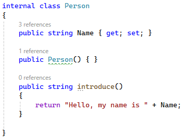

# Class Methods

Okay, so we've done the basics. We've created a class, given it a property, and utilised that class in our output.

In Go, when we define methods, we defined them outside the struct with a receiver to say they belonged to a struct.


In C#, it's very different - methods belong to classes and are defined inside them.

Let's go back to our Person class and create a method to see what we are talking about.

## My First Method

Much like in Go, methods have a name, parameters, and return type. Unlike in Go, all of this is done very, very differently.

Here's an example of a method that takes no parameters and returns a string:

```c#
public string introduce() {
    //...code
}
```

First off we declare this method to be `public`, accessible from outside our namespace (or package in Go).

Next we declare `string` which is actually the *return* type. I know, I know. We're used to it being after the parameters. It isn't - this is just the way it is!

Finally we have the name of our method `introduce()`. Well, at least this bit is the same, as are the curly braces enclosing the code!

> You'll notice there's no keyword like `func` here. 

Let's go ahead and update our class:



Okay, so now we are returning a string from the method, and that string will be "Hello, my name is " plus whatever is stored in the `Name` property.

> You may notice here that we don't have that pointer receiver in C#, so how does it know what properties it has access to? Well, that's because of the scope. With methods defined inside the class, the code has access to its own properties. In Go, we have to do some magic to say "this belongs to this" to get this sort of functionality. 

## Utilise our method!

Right, let's see this working. Go back to Program.cs and change the Console.WriteLine to use `p.introduce()`:

```c#
Console.WriteLine(p.introduce());
```

Run your code!

## Lab - Update the class

1. Add a new property, `Age` to the class that is of type `int`.
2. Update your `Program.cs` to set the age.
3. Add a new method to your Person class called `sayAge` that takes no parameters and returns a string saying "I am " plus the value stored in the property `Age`.
4. Update your Program.cs and add a new `Console.WriteLine` to print out the result of calling this new method.

***

## Parameters and `void`

Okay, now we've done parameterless methods, it's time to gear up a bit more. Let's start passing some parameters into a method.

We're going to create a new method called updateName that will accept one parameter of type string, and update the person's Name variable. It won't return anything.

In you Person.cs file, add the following:

```c#
public void updateName(string newname)
{

}
```

### What the hell does `void` mean?

`void` is simply a way to say "this method (or function) does not return anything". In Go we would have just 

```go
func updatename(newname string) {
    //code...
}
```

But C# requires us to *explicitly* state the method will return nothing.

> Also note how the data type and the parameter name are the other way round in C# and Go!

Okay, let's add some code into that method to make it useful:

```c#
public void updateName(string newname)
{
    Name = newname;
}
```

`Name` here is our property in the class we are updating, and `newname` is the string parameter we passed in. Note again it's a statement, so we *MUST* finish the line with the semi-colon.

Let's try using it! Go back to your `Program.cs` and add the following line of code just above your first `Console.WriteLine`:

```c#
p.updateName("Oswald");
```

Here we are using our instance `p`, calling the method `updateName` and providing a parameter of `Oswald`.

Our method then takes care of updating the actual name property. Let's run the code to see what happens!

## Lab - Update the class again

3. Add a new method to your Person class called `updateAge` that returns nothing and has one parameter `newage` of type `int`, which updates the `Age` property in your class.
4. Update your `Program.cs` to call the `updateAge` method with a new age just before the `Console.WriteLine`.

## Multiple parameters

So far we've only provided single parameters. What happens if we want to provide multiple parameters?

Good question, and it's almost exactly the same as Go - we add the data type, the name, and separate the list br using a comma:

```cs
public void updateNameAndAge(string name, int Age){
    //code...
}
```

> Remember, in C# it's type first, then the parameter name!

***

[Chapter 3 >>](/part3/chapter03.md)