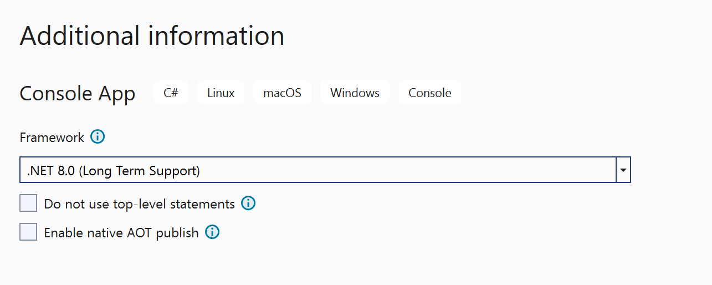
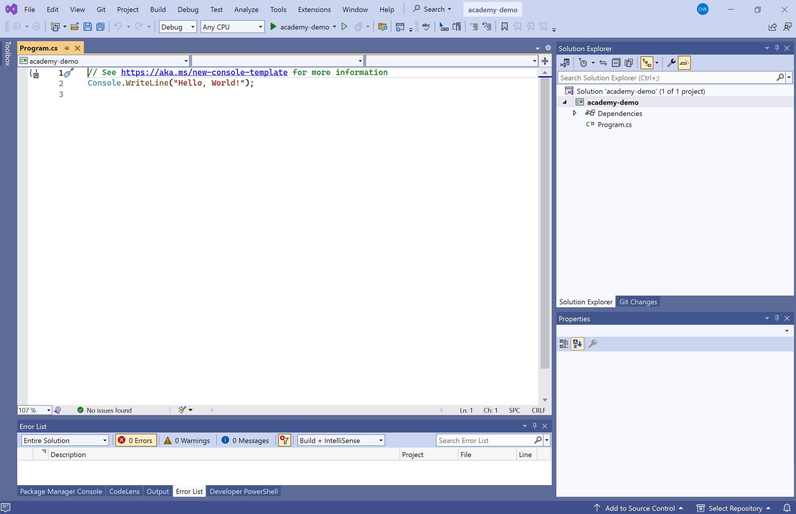
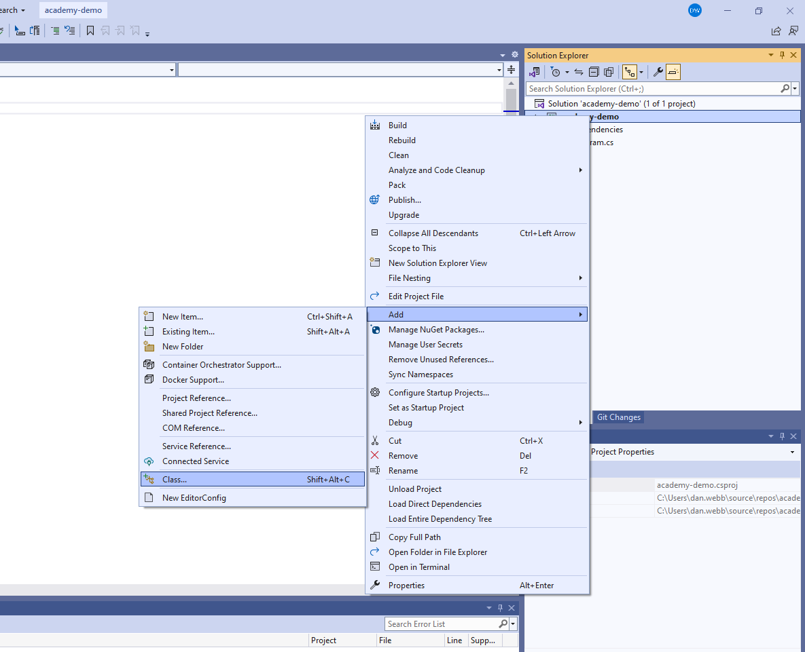
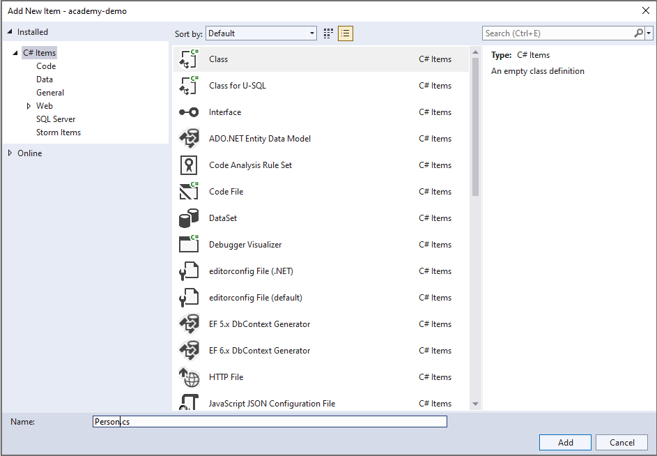

# Class-Based Languages
## Java For Idiots - Also Known As C#

`C#` (pronounced "C sharp") is a programming language developed by Microsoft within its `.NET` initiative, and its history is closely tied to the evolution of Microsoft's software development platform.

Originally created by Anders Hejlsberg in 1999 and released in 2000 at part of the .NET framework, it was influenced by several programming languages including C++, Java and Delphi.

C# has been open source since 2014, and the introduction of .NET Core, made it a proper cross-platform language.

C# is a multi-paradigm programming language, meaning it supports several programming paradigms, including object-oriented programming (OOP), imperative, declarative, and functional programming styles. 

We, however, are going to be focusing on its OOP abilities.

## Setup

[Install Visual Studio Community](https://learn.microsoft.com/en-us/visualstudio/install/install-visual-studio?view=vs-2022)


Once installed open up Visual Studio, and click on `Create a new project`:


Search for console on the next page and click the top option and then click Next:


Configure the project as below and click Next:


Configure the additional options as below and click Create:



## The IDE

The next thing you see should be the integrated development environment, or the IDE:



The main windows has the Program.cs file displayed with the code:

```c#
Console.WriteLine("Hello, World!");
```

Press F5 to run the program which will open a console window and print out:


Well done, you have just completed your first C# program!

## Adding A File

Now we are going to add a new file. Since we want to learn about classes, we're going to add a new class.

To do this, right-click on the `academy-demo` on the file list on the right (the one in bold), and select `Add > New class` from the menu:



Now, in the window that pops up, you have to name your class - we're going to name the class `Person.cs` and click Add:



Which will add the file to your project, and open it up in the editor window for you:


## Anatomy of a Class

Right, first up you'll see this at the top of the class:

```c#
using System;
using System.Collections.Generic;
using System.Linq;
using System.Text;
using System.Threading.Tasks;
```

These are the same as the `import` statement in Go - they are standard library (contained in the System library). C# automatically imports them for us, even if we are not using them, unlike Go.

Next up we have the namespace and class declaration:

```c#
namespace academy_demo
{
    internal class Person
    {
    }
}
```

In C#, a namespace is like a container or a directory that holds a group of related classes, structs, interfaces, etc like a package in Go. It helps in organizing and managing the codebase. In this code, `namespace academy_demo { ... }` is creating a namespace called academy_demo.

in Go, we would have used something like 
```go
package academy_demo
```

Now, the internal access modifier in C# is somewhat similar to Go's concept of visibility (private vs public). It restricts access to the class (Person in this case) to within the same *assembly* (a compiled unit of code, a bit like a Go package). So, any other code outside of this assembly won't be able to directly access this Person class. Think of it as a way to control which parts of your code can use this class.

Finally, `class Person { ... }` is defining a class named Person within the academy_demo namespace. 

A class is a blueprint for creating objects. It can have properties (fields in Go)  and methods that define its behaviour - like how we used `structs` in Go when we added methods.

## Adding some properties

Let's add a property - or field - to our class:

```c#
internal class Person
{
    private string Name { get; set; }

}
```

Much like we would do on a struct in Go when adding a field with a few subtle differences:

- `private` keyword: this - not the capitalisation of the first letter - determines whether the property is private and not accessible outside of its own namespace. Alternative is `public`.
- `string`: the data type - in C# it goes *before* the property/variable name
-  `Name`: the property/variable name
- `{ get; set; }`: shorthand for defining a property with both a getter and setter

**Getter (get)**: The getter method *retrieves* the current value of the property. When you access the property from outside the class, the getter is invoked to return the value.

**Setter (set)**: The setter method allows you to *assign* a new value to the property. When you assign a value to the property from outside the class, the setter is invoked to update the property's value.

Really what this is doing is some magic under the hood and creating a "backing field". But let's not worry about it for now, just know that in a class, if you have a property you want to be able to set or get the value of, you need this magic syntax.

## Using our class

Okay, let's switch back into the `Program.cs` window.

Add a new line above the Console.WriteLine:

```c#
Person p = new Person();
```

We've got a few new things to deal with here (including my badly named variable `p`).

First off, the Person class, like a struct, is a complex data type. In C#, we declare the type before the variable name:

```c#
Datatype variablename
```

Then we have our assignment operator `=`, like in many other languages. Unlike Go, we do NOT have the short assignment operator `:=`.

On the right of the assignment operator we have something we have not seen before, they keyword `new` followed by the data type we want to construct (Person), a set of empty parenthesis `()` and a semi-colon `;`.

What that all means is we are instantiating a new instance of the class Person with no constructor parameters and saying we have completed this line of code.

**What?**

Okay, let's take some time here and explain each part.

### The `new` keyword

This is used to create a new instance of an object. We've done this in Go before to create an instance of a struct:

```go
p := Person{}
```

### The `Person` class

The Person class we previously defined. By default in Go, we don't have a concept of a "*constructor*" which we will explain shortly. 

### The empty parenthesis

The way we do it on Go is something like:


```go
p := Person{Name: "John"}
```

Which assumes we have a struct with a field called Name.

We can do a similar thing in C#:

```c#
Person p = new Person() { Name = "Ted" };
```

But you will notice the empty parenthesis are *still there* and we use the `=` assignment operator.

> If you have just tried this in your code and found that there's lot's of squiggly lines, we'll explain that in a moment too!

The empty parenthesis are the *constructor*, and they are a way of passing values as *parameters* to the class when you instantiate it. 

By default C# creates a magic "default constructor" which takes no parameters that you cannot see.

We can actually go and create our own default constructor in `Person.cs` :

```c#
public Person() {}
```


> NOTE constructors need to be `public`, for now. Later maybe we can have private ones...

This is what C# is actually doing for via magic. We'll come back con constructors a bit later, but for the moment you can think of them like function parameters we have used in Go.

### The semi-colon

Right at the end of the line you will see the semi-colon `;`. This is what C# uses to denote the end of a statement, and is a fundamental part of the C# syntax.

Go is delimited by the line break and doesn't need this. But in C# (and many other languages) you absolutely need this!

Think of the semi-colon for the moment as "I have finished everything I want to write on this line thank you".

## Let's try and set the Name of our person

Okay, let's switch back to our Program.cs, and update the line where we instantiate our new person:

```c#
Person p = new Person() { Name = "Ted" };
```

What you'll notice here is the `Name` has a red line underneath:


What's *really* useful now, is that if we hover the mouse cursor over the underlined issue, the IDE will tell us what the problem is:


The cryptic `'Person.Name' is inaccessible due to its protection level`.

What does that mean? `Name` uppercase, so it should be available, right?

> *Oh, right. This is C# not Go.*

Let's hop back to Person.cs and change:

```cs
private string Name { get; set; }
```

to be

```cs
public string Name { get; set; }
```

In C# (and many other languages) you have to be very specific about `private` or `public`, and you use those keywords.

Now switch back to our Program.cs file and you'll see the red line has gone. Hurrah!

Now that we have got our declared and instantiated class, we can use it to print out the person's name.


Let's update the Console.WriteLine to be:

```c#
Console.WriteLine("Hello, " + p.Name);
```

> As you can see, we access properties in C# the same way we access fields in Go, by using the dot notation to get a list of available fields or methods to display.

Run the program (F5) and see you new class at work!

***

## Setting properties directly

Of course, this isn't the only way to set the properties. We've seen in Go we can do:

```go
p := Person{}
p.Name = "Suzy"
fmt.PrintLn("Hello " + p.Name)
```

The same is true in C#:

```c#
Person p = new Person();
p.Name = "Suzy";
Console.WriteLine("Hello " + p.Name)
```

The only real different here is the use of the `new` keyword and parenthesis `()` rather than curly braces `{}`. Oh, and the semi-colon at the end of each line!